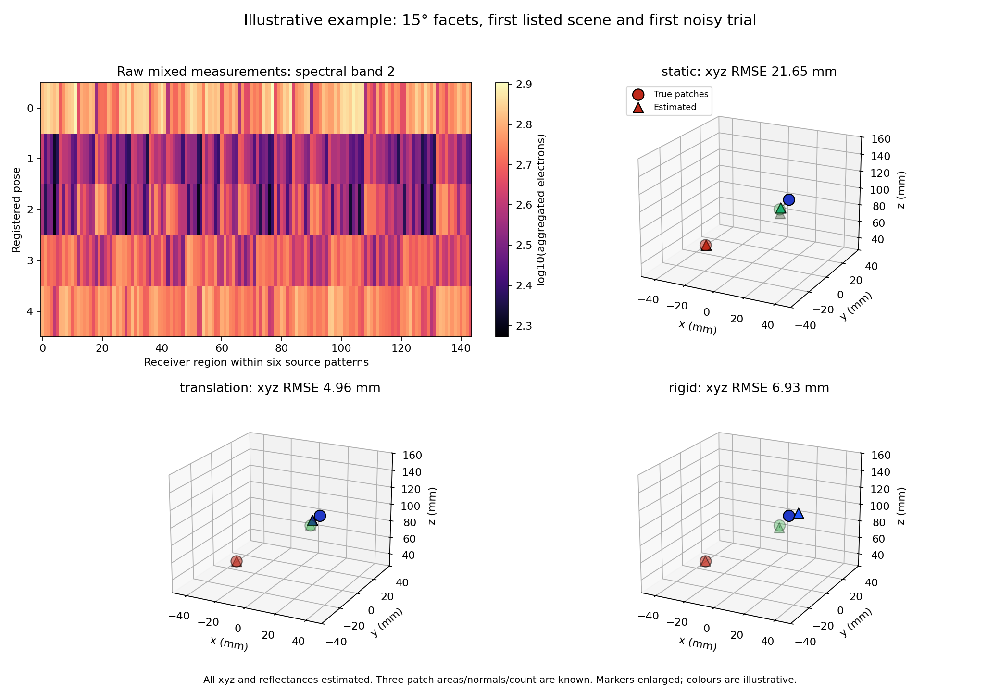
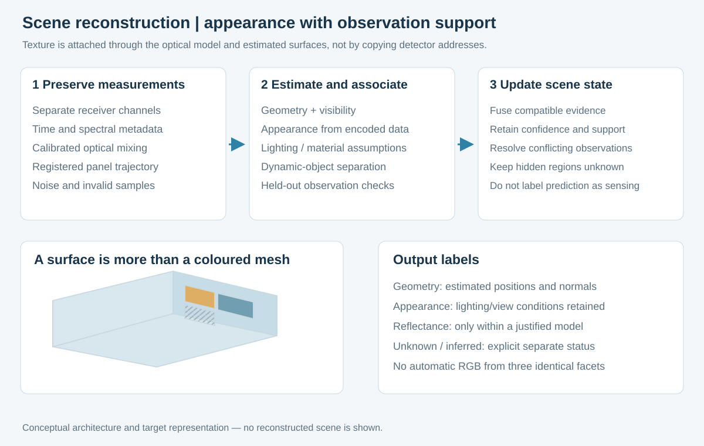

# FacetCensus — перепись поверхностей

Восстановление окружения и внешнего вида поверхностей по оптическим измерениям экрана.

**Основная идея — использовать измерения всей чувствительной матрицы, известные состояния освещения и зарегистрированное движение панели для построения и обновления модели видимой сцены.** Результат должен включать геометрию, привязанный к поверхностям внешний вид, видимость и неопределённость.

Пирамида не является обязательной основой. Рассматриваются плоские фотодиоды рядом с излучателями, светочувствительные элементы с режимами излучения и приёма, а также несколько независимо считываемых оптических областей. Конкретные маски, апертуры, спектральные каналы и грани должны давать достаточно различающиеся измерения.

В варианте с обратимыми пикселями роли назначаются целым пикселям: одни освещают, другие принимают; все грани принимающего пикселя читаются отдельно. В варианте с отдельными фотодиодами излучатели и приёмники — разные физические элементы.

## Новый шаг: координаты и цвет неизвестны

[Вычислительный демонстратор](studies/scene-reconstruction-2026-09-28/REPORT_RU.md) теперь получает смешанные сигналы, известные позы и подсветку, а затем оценивает **все xyz и три коэффициента отражения каждого из трёх участков**. Боковые координаты больше не заданы. Число участков, их площадь и нормали пока известны; это ещё не восстановление произвольной поверхности или текстурированной комнаты.

В ближней сцене для граней 15° медианная ошибка координат по трём шумовым реализациям уменьшилась с 3,45 мм без движения до 1,07 мм при перемещениях с поворотами. Плоская матрица также восстановила эту сцену — 1,39 мм; в другой сцене она оказалась точнее гранёной. Близкие участки одного цвета дали большие ошибки во всех вариантах. Поэтому преимущество конкретной формы и устойчивость общей реконструкции не установлены.

Сохранены все 360 запусков для 60 наборов данных, включая 20 несходимостей; у трёх выбранных решений сходимости нет, у 30 достигнута граница координат или отражений. Отдельно реализовано уточнение сохраняемой тройки участков после 1/3/5 поз. Это работающий программный пример на синтетике, без обучения сети и без изготовленного экрана.

[Формулировка авторского вклада](docs/AUTHOR_CONTRIBUTION.md) связывает три части: зарегистрированные смешанные измерения, совместную оценку геометрии/внешнего вида и обновление состояния с явными ограничениями. Пирамиды и нейросеть остаются вариантами реализации.

## Геометрия и текстура

Восстановление должно учитывать смешение света от разных точек сцены. Нельзя просто перенести сигнал фотодиода на поверхность по его адресу в матрице. Сначала нужен откалиброванный измерительный оператор и оценка геометрии/видимости, затем совместная либо последовательная оценка внешнего вида.

Цвет под конкретным освещением не равен собственной отражательной способности материала. Три грани не означают три цветовых канала. Ненаблюдаемые поверхности и дорисованные детали должны сохранять явную отметку «не измерено».

Схемы показывают требуемую организацию системы и результата, а не уже восстановленную комнату. Стабильные участки можно сохранять между наблюдениями; новые данные уточняют геометрию и внешний вид. Предобученная модель при этом не обязана переобучаться.

## Конкретная схема алгоритма и готовые экраны

[Последовательность измерений](docs/MEASUREMENT_SEQUENCE.md) объясняет переход от сырых смешанных откликов к карте: при движении всей панели сопоставляются изменения показаний всех каналов с учётом зарегистрированных поз и подсветки. Возможные геометрия и внешний вид сцены должны предсказывать эти показания; сравнение уточняет координаты поверхностей, цвет при достаточных спектральных измерениях и неопределённость. Отдельное световое «пятно» на карте откликов не считается уже найденной пространственной точкой. Это описание предполагаемого процесса, а не результат работающей реконструкции.

[Проект алгоритма](docs/RECONSTRUCTION_DESIGN.md) задаёт калибровку каналов, метрическое поле геометрии и внешний вид, физический расчёт измерений, совместное уточнение глубины/цвета и необязательную обучаемую регуляризацию. Новые наблюдения обновляют состояние сцены; предобученные веса при работе остаются фиксированными. Нужны проверка по удержанным измерениям, оценка неопределённости и отделение наблюдённых поверхностей от предположений. Это спецификация, а не уже обученная сеть.

[Аппаратные варианты](docs/HARDWARE_PATHS.md) объясняют, почему обычный экран нельзя превратить в распределённый фотоприёмник одной программой: нужны физическая чувствительность, цепь считывания и доступ к сырым данным. Готовые светодиодные матрицы с измерением общей освещённости существуют, но это ещё не пространственная камера. Специальные панели с фотодиодами и обратимыми элементами рассматриваются отдельно; доступная готовая модель для всей системы пока не подтверждена.

## Что уже подтверждено источниками

В существующих исследованиях показаны встроенные фотодиоды, цветное сканирование поверхности дисплеем, двуфункциональные светодиоды и вычислительное изображение на обычных матрицах с масками/диффузорами. Это исходные технические возможности, а не доказательство всей предложенной системы. [Сравнение и первичные источники](research/RELATED_WORK.md).

## Малый наклон как новый кандидат

[Малые наклоны 5–45°](studies/small-tilt-2026-09-28/REPORT_RU.md), включая 15°, проверены отдельно. В широкой косинусной модели фронтальной слепой зоны нет ни при 45°, ни при 15°. При одинаковом основании суммарный фронтальный приём сохраняется. Для выбранного режима прямая засветка при 15° около 0,39% против 3,87% при 45°, но относительные угловые различия каналов слабее примерно в 3,73 раза. Узкие конусы приёма рассмотрены только как условные примеры. Сама эта геометрическая диагностика не устанавливает оптимальность 15°, реальную ближнюю зону или преимущество по глубине; отдельная обратная задача рассмотрена ниже.

## Рабочий угол после проверки глубины

[Новая проверка угла](studies/angle-selection-2026-09-28/REPORT_RU.md) содержит ещё **20 160 шумных подгонок**, плоские контроли и сравнение при одинаковой активной площади. На 12 новых сценах средняя относительная ошибка глубины составила:

| Вариант | Ошибка при равной активной площади |
|---|---:|
| Плоская матрица, сумма областей | 5,81% |
| 15° | 4,76% |
| 20° | 4,57% |
| 30° | 4,79% |
| 45° | 5,92% |

**Рабочим кандидатом остаётся 15°**, поскольку по заранее заданному правилу выбирается меньший проверенный угол с ошибкой не более чем на 10% выше минимума. Наблюдаемый минимум здесь у 20°, но разница 15°–20° не установлена статистически. Для следующего опыта выделяем 15–25°, сохраняя 30° как контроль: на предыдущих трёх сценах лучшим был именно он. Это диапазон проверки, а не доказанный оптимум; 5°/10° на новых 12 сценах не проверены.

Условие таблицы — пропускание 10⁻⁶ прямой засветки, способ достижения которого пока не показан. При остаточной доле 10⁻⁴ на предыдущих трёх сценах плоский контроль оказался лучше гранёных. Восемь подгонок на границе допустимой глубины сохранены в результатах. Непрерывное покрытие зоны непосредственно перед экраном, восстановление дальней сцены, повороты и реальные матрицы этим расчётом не подтверждены.

## Что выполнено здесь

- [144 синтетических измерения одного пятна](example/EXAMPLE.md): совместная подгонка при известных позах и идеальных условиях.
- [Сравнение укладок](angular-comparison/README.md): авторский вертикальный сдвиг уменьшает провалы суммарного приёма при скользящих направлениях в выбранной модели. Средний сбор света почти не меняется.
- [Исследование засветки и глубины](studies/layout-noise-2026-09-27/REPORT_RU.md): 18 конфигураций и 8 800 шумных подгонок. В выбранном режиме сдвиг уменьшил прямую засветку; отдельно подтверждён вред её фотонного шума. Универсальный победитель по глубине не установлен.
- [Точная геометрия кандидата](docs/GEOMETRY_EXAMPLE.md): треугольники вверх, вертикально сдвинутые столбцы, равнобедренные боковые грани.

Ни один из этих расчётов пока не восстанавливает окружение с текстурами. В ранних задачах с двумя участками известны их боковые координаты и нормали, нейросети и поворота панели нет. В последующем опыте xyz неизвестны и добавлен поворот, но площадь, число и нормали трёх участков заданы. Одна подгонка в исследовании 27 сентября не достигла сходимости и явно отмечена; в подборе угла 28 сентября несходимостей нет. Последующий опыт с неизвестными xyz содержит отдельно перечисленные несходимости и граничные решения. Квадратные пирамиды рассчитаны с одинаковым поворотом; уточнённая автором чередующаяся ориентация квадратов не проверена. Изготовленного устройства, доказанного общего преимущества или установленной новизны нет. Следующая проверка должна включить неизвестные поверхности и реальные отклики при сопоставимых площади, свете, времени и шуме.

[Основная статья](FACETCENSUS.md) содержит полную архитектуру, модель измерений, ограничения и критерии проверки. Это открытая техническая публикация, версия 2026.09.28.1. Название объединяет facet («грань») и census («перепись»); «перепись поверхностей» описывает замысел системы. Эта редакция меняет название и оформление, сохраняя научное содержание и результаты публикации 28 сентября. Точный состав фиксируется коммитом Git; новые подробности и расчёты не приписываются предыдущей публичной редакции от 25 сентября.
