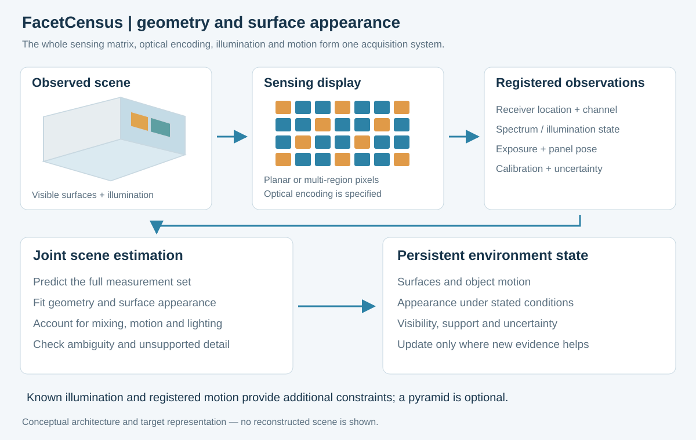

# FacetCensus

**A census of surfaces — перепись поверхностей.**

Philipp Dik · research concept · technical publication `2026.09.29`

FacetCensus proposes a display-associated sensing matrix that keeps optical channels separate and uses their changes across registered panel motion, illumination and tracked scene motion to update a persistent map of surface geometry and appearance. Facet orientation supplies directional diversity; placement and scheduling control unwanted light transfer between elements.

Read the **[manuscript](FACETCENSUS.md)** or the **[Russian overview](OVERVIEW_RU.md)**.

## Architecture and implementation

- [Measurement sequence](docs/MEASUREMENT_SEQUENCE.md): raw mixed responses, changing acquisition states and scene updates.
- [Reconstruction design](docs/RECONSTRUCTION_DESIGN.md): calibrated forward model, physical inversion, optional learning and persistent state.
- [Available-component baseline](studies/component-baseline-2026-09-29/README.md): documented hardware paths, channel-direction counts and fixture arithmetic.
- [Hardware interfaces](docs/HARDWARE_PATHS.md), [candidate geometry](docs/GEOMETRY_EXAMPLE.md), [author contribution](docs/AUTHOR_CONTRIBUTION.md) and [related work](research/RELATED_WORK.md).

## Supporting calculations

The [numerical appendix](docs/NUMERICAL_STUDIES.md) records each study's assumptions and findings. It includes the [layout/coupling experiment](studies/layout-noise-2026-09-27/README.md), a [restricted joint position/appearance example](studies/scene-reconstruction-2026-09-28/README.md), and earlier angular/depth diagnostics. Angle rankings describe their particular synthetic tasks; hardware selection uses the response and coupling measured for the chosen components.

Each study directory contains its data, reproduction commands and dependencies. The new [component calculation](studies/component-baseline-2026-09-29/calculate.py) uses Python's standard library. Earlier examples use [NumPy and SciPy](requirements.txt); the [larger studies](studies/layout-noise-2026-09-27/requirements.txt) retain their pinned environment.

## Publication record

Earlier names were **Perceptive Pixel** and **FacetSensus**. The repository address and article compatibility links preserve continuity. See the [change record](CHANGELOG.md), [citation metadata](CITATION.cff) and [original public archive](archive/2026-09-25/README.md). Cite a specific Git commit to identify the exact text, code and results.
