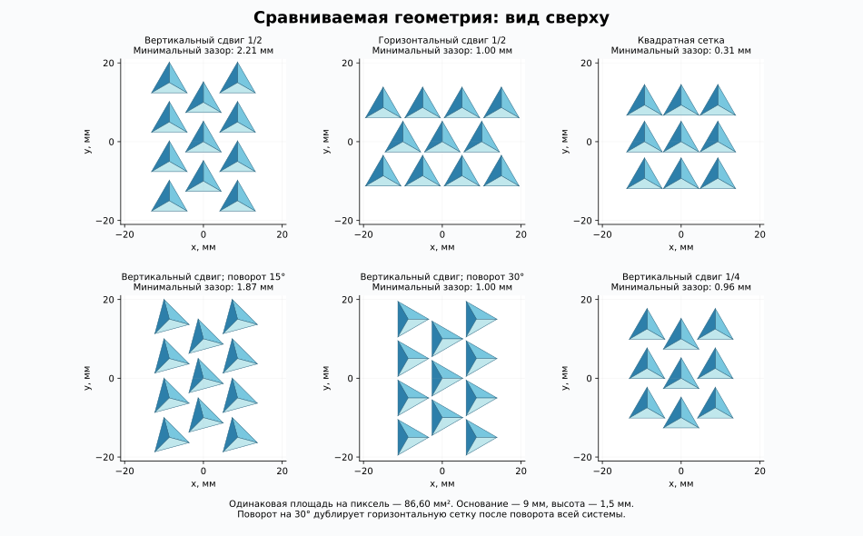
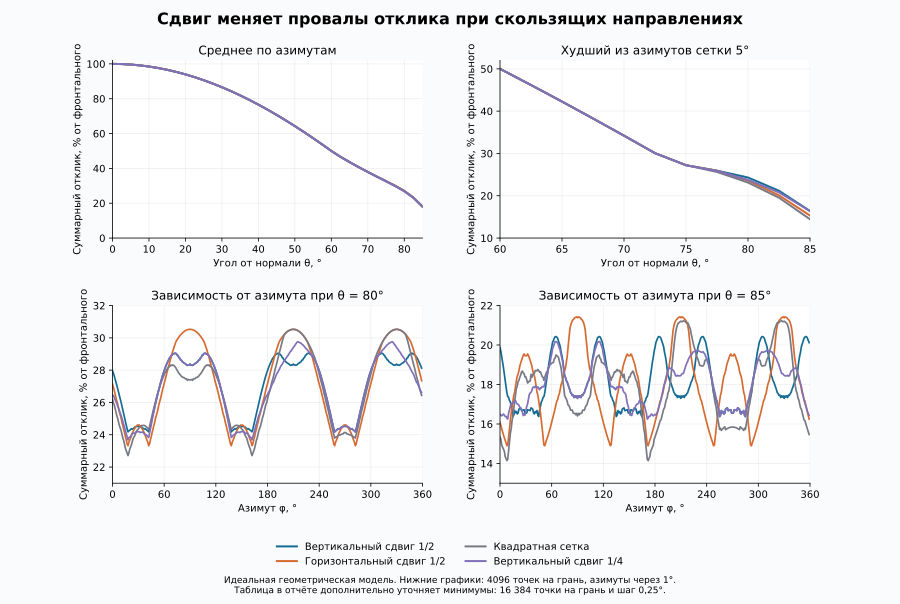

# Finite-area angular collection benchmark

This optional geometric benchmark compares six configurations (five independent geometries) of opaque triangular pyramids at equal density. It is not a reconstruction model or a fabricated-device measurement.

The author's design is the upper-left case: all triangles point upward and adjacent columns are displaced vertically by half the column pitch. Base side 9 mm; height 1.5 mm; normal tilt 30 degrees; cell area 86.6025 mm². The 30-degree rotated case is equivalent to the horizontal lattice after a global rotation and serves as a consistency check.

## Results

| Layout | Mean response at 85° | Refined sampled worst response at 85° |
|---|---:|---:|
| Vertical half-pitch stagger | 18.07% | 16.49% |
| Horizontal half-pitch stagger | 18.08% | 14.82% |
| Equal-density square | 17.97% | 14.09% |
| Vertical stagger; pyramids rotated 15° | 18.07% | 15.95% |
| Vertical stagger; pyramids rotated 30° | 18.08% | 14.82% |
| Vertical quarter-pitch stagger | 18.01% | 16.22% |

Angles are measured from the panel normal; 85° is only 5° above its plane. Responses are normalized to frontal total collection. Up to 60°, the total is identical across these layouts and equals cos(theta). The half-response cone is approximately 60° in half-angle for all layouts. Mean collection is similar; the vertical stagger reduces the worst-azimuth troughs in the tested 80° and 85° slices. No global optimum is established. The displayed precision facilitates comparison and is not an instrument accuracy claim.

For each facet, effective area equals its area times the positive normal-direction cosine times its unoccluded fraction. All side faces receive independently; the table sums their signals and averages the two cell positions for quarter staggering. Rays are tested against a periodic neighborhood sufficient through 85°. The model excludes refraction, diffraction, internal scattering, coatings, supports, electrical effects, noise and scene reconstruction.

## Numerical checks and limits

- Main grid: polar angle every 2.5°, azimuth every 5°, 1024 equal-area samples per face, compared with 64 samples.
- The 80°/85° slices use 4096 samples per face and 1° azimuths. Increasing from 1024 to 4096 samples changed total normalized response by at most 0.34 percentage points on these common slices.
- Local minima are refined with 16384 samples per face and 0.25° azimuth steps near six separated low-response regions. Minima changed by at most 0.12 percentage points from the preceding refinement. This is empirical convergence, not a rigorous continuous-global-minimum error bound.
- An independent triangle-intersection reference agreed on all 54144 active rays in its bounded validation sample; zero channel-response discrepancy. Its full direction/point selection contains 75264 rays, including back-facing channels with zero response.
- Normals, areas, equal density, disjoint footprints, periodicity, own-cell exclusion, enlarged neighbor radius and global-rotation equivalence were checked. The sampled collection satisfies the periodic incident-flux bound.
- The diffuse integral is truncated at 85°. The omitted 85–90° sector is bounded by 0.760% of incident hemispherical flux on the cell. Small differences between the approximately 42% truncated collection fractions are not used to rank layouts.

[Numerical table](summary.csv) · [main data](results-n32.json) · [slice refinement](refinement.json) · [minimum refinement](minima-refinement.json) · [independent verification](independent-ray-check.json).

Run the commands in the [repository README](../README.md). Source figures accompany the results; the plot labels are Russian. The methods concern collection geometry only and do not establish useful texture resolution or three-channel observability of a general scene.
