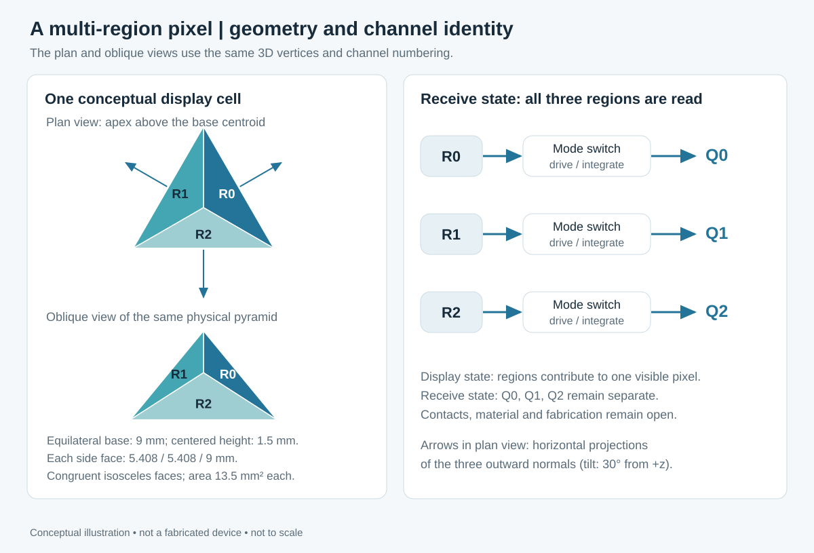
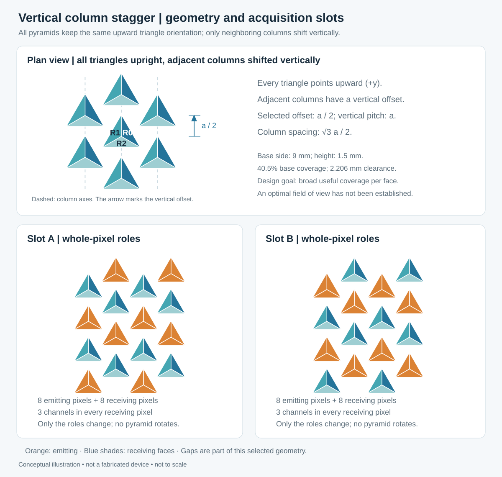

# Candidate geometry: upright pyramids with vertically staggered columns

This appendix preserves one author-specified candidate within the broader scene reconstruction architecture. Dimensions and half-pitch offset are illustrative choices.

For the illustrations, a display cell groups three electrically isolated optoelectronic regions on differently tilted carrier faces. Each region has its own electrical path to a mode switch and readout integrator. In display mode the three regions contribute to one visible cell. In receive mode all three integrate their own photocurrent; they are not divided into emitting and receiving facets. A conceptual charge measurement is Q_k = integral(I_photo,k dt), followed by offset and gain correction.

This layout is an illustrative implementation choice introduced to explain the proposal. It does not imply that separate signals can be extracted from arbitrary faces of one unmodified semiconductor crystal. Junction material, electrical isolation, contacts, recovery time, spectral overlap and the manufacturing process remain to be engineered. A cell made from isolated regions is also not yet a demonstration of dense display integration or uniform visible output.

The illustrated cell is a regular triangular pyramid: an equilateral base of side b and an apex directly above its centroid. The three congruent lateral faces are isosceles triangles. Their outward normal vectors are n_k = (sin(theta) cos(phi_k), sin(theta) sin(phi_k), cos(theta)), with theta = 30 degrees and phi_k = 30, 150, 270 degrees for channels R0, R1, R2. Height h = b tan(theta)/(2 sqrt(3)). The selected example uses b = 9 mm, h = 1.5 mm, equal sloping edges of 5.4083 mm and lateral face area 13.5 mm². Each entire ideal face is treated as one active region. These are explanatory dimensions, not a fabricated pixel specification or an optimum.

*Figure 2. Conceptual geometry and channel identity. This is not a fabrication cross-section; each colored active region requires electrical isolation and an individual receive path.*

## Upright pyramids and vertically staggered columns

All base triangles point upward (+y in plan view); neighboring triangles are not reversed. The author specifies a vertical offset between adjacent columns. For this example, row r and column j have centers c(r,j) = (a sqrt(3) j/2, a[r + (j mod 2)/2], 0), before subtracting the array centroid. Pitch along a column is a, column separation is a sqrt(3)/2, and odd columns shift upward by a/2. The half-pitch shift and dimensions are explanatory choices, not established optima. This placement is independent of electronic role assignment.

With a = 10 mm and b = 9 mm, base footprints do not overlap and their minimum clearance is a - sqrt(3)b/2 = 2.205771 mm. Periodic base coverage is b²/(2a²) = 40.5%; remaining space is open. In the interior, the six nearest centers have azimuths 30, 90, 150, 210, 270 and 330 degrees. The three vertex directions point toward one set of alternating neighbors, while horizontal projections of the three face normals point toward the other set. These directions must not be described as bisecting the nearest-neighbor directions.

For this ideal geometry, a ray along an outward face normal rises above the maximum pyramid height after at most h tan(theta) = 0.866 mm of horizontal travel, less than the 2.205771 mm base clearance. It therefore clears other equal-height pyramids even though its plan projection points toward a neighboring center. This narrow geometric property does not establish an optimal field of view, unrestricted angular reception or minimum refraction. Other incident directions, finite active areas, materials, supports and coatings need separate assessment. The separate [angular benchmark](../angular-comparison/README.md) now compares finite-area geometric collection across layouts. It does not establish a system reconstruction benefit.

The [independent geometry checker](../example/check_geometry.py) verifies equal face edges, normals from cross products, vertical column offsets, nearest-neighbor directions, all 120 footprint pairs and the normal-ray clearance bound. Its [numerical results](../example/geometry-check.json) accompany the example. The diagrams and radiometric model use the same vertices, centers and facet numbering.

The same geometry is used in two distinct idealized calculations. The [single-patch example](../example/EXAMPLE.md) uses co-located facet response approximations. The [layout benchmark](../angular-comparison/README.md) traces finite facet areas and neighboring opaque pyramids. Neither is a textured-scene reconstruction.

## Additional small-tilt candidates

The 30° geometry above remains the original worked example. A later [small-tilt study](../studies/small-tilt-2026-09-28/README.md) evaluates 5–45°, including the author's new 15° candidate. At the same 9 mm base side, 15° gives height 0.696 mm. Facet-normal tilt must not be confused with acceptance-cone half-angle. The broad cosine model has no frontal acceptance hole at 45°; actual narrow optics could create one. Small tilts reduce direct coupling but also reduce angular diversity. No candidate is declared optimal.
