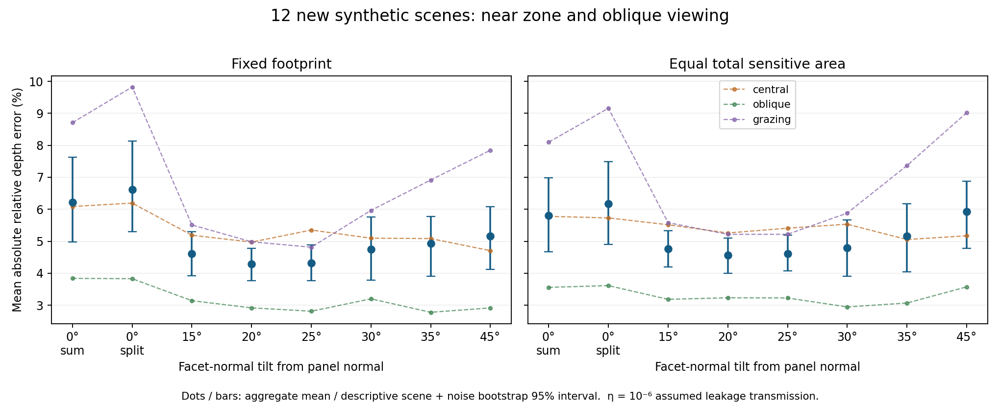

# Conditional tilt selection and planar controls

28 September 2026. Synthetic, restricted two-patch inversion.

**Interpretation update, 29 September:** the angle-selection rule below belongs to this historical numerical task. The current [concept article](../../FACETCENSUS.md) selects hardware geometry through measured directional response and per-channel coupling; it prescribes no system-wide optimum angle.

**15° is the working candidate under a predeclared smallest-within-10% rule; 20° has the lowest observed mean error in the 12-scene challenge.** Their descriptive difference intervals include zero. Prioritize 15–25° for subsequent investigation, retaining 30° as a control because it won the earlier three-scene validation. This is not a universal optimum or a confidence interval for the best angle.

The primary assumed direct-leakage transmission is **η=10⁻⁶, with no demonstrated suppression hardware**. The same-area comparison gives:

| Tilt / readout | Fixed footprint | Equal total sensitive area |
|---|---:|---:|
| 0° / pooled | 6.21% | 5.81% |
| 0° / split | 6.62% | 6.17% |
| 15° | 4.61% | 4.76% |
| 20° | 4.29% | 4.57% |
| 25° | 4.33% | 4.62% |
| 30° | 4.75% | 4.79% |
| 35° | 4.93% | 5.16% |
| 45° | 5.16% | 5.92% |

Values are mean absolute relative depth errors, equally weighted over two patches, 48 noise trials and 12 scenes (four central, four oblique, four grazing). In the equal-area case, 15° gives 4.76% versus 5.81% for the pooled planar control, about 18% lower in this conditional task. The descriptive difference interval is −1.97 to −0.26 percentage points. Intervals are exploratory, not adjusted for model/angle selection or multiple comparisons.



## Protocol and limitations

All triangular bases point in the same direction, with vertically offset neighboring columns. Tilt is facet-normal angle from the panel normal. Three known translations of −20/0/+20 mm and two whole-pixel source/receiver schedules are used on a 4×4 panel. Three spectral bands are independent of the three facets. Two 1 mm² diffuse patches have known lateral positions, areas and normals; only two depths and six reflectance coefficients are fitted. The later challenge samples axial depths in specified ranges 25–180 mm, but central scenes start at 75 mm. It does not establish continuous near-field coverage or depth performance immediately in front of the screen.

Emitted energy, exposure and 1,728 raw readouts are matched. The pooled planar control sums the same three noisy observations, with read variance 48 versus 16 per separate region; it is not a single-read physical detector. Better pooled estimates do not mean information removal is fundamentally beneficial. To equalize active area, all pyramid dimensions shrink by √cosα at fixed center spacing; gaps, height and visibility consequently change too.

Initial selection examined 0–60° on three scenes and selected 15° (minimum 20°). Three new validation scenes favored 30°. The additional 12-scene challenge therefore tests robustness, with its protocol saved before those fits. Only 15/20/25/30/35/45° and 0° were included in this challenge: it does not rule out 5°/10° on these scenes. Planar zero-angle differences across independent experiments are Monte Carlo variability.

At η=10⁻⁴ on the three validation scenes, pooled planar error was 3.96%, versus 5.53%, 5.56%, 5.90% and 6.97% for 15/20/30/45°. **The planar control wins that leakage scenario.** A fixed-budget far-scene local-information diagnostic is severely ill-conditioned; it does not demonstrate useful distant mapping. Internal crosstalk, saturation, real sensor spectra, pose error, panel rotations, unknown general surfaces and learned reconstruction are absent.

## Evidence and reproduction

The two new stages contain **20,160 noisy fits**, all optimizer-converged, with **eight retained boundary fits** in the challenge. Selected quadrature refinements change direct-coupling vector norms by at most 1.00% and useful-signal norms by 0.014%; the largest selected fine-forward/coarse-inverse noiseless depth error is 0.022 mm. These are numerical checks, not hardware validation.

The [Russian report](REPORT_RU.md) gives the complete protocol, leakage table and qualifications. Read the [hardware comparison](HARDWARE_RU.md), [first protocol](protocol.json), [frozen initial choice](selection_frozen.json), [challenge protocol](range_protocol.json), [initial raw results](results.json), [challenge raw results](range-results.json), [bootstrap summary](range-summary.json) and [numerical checks with retained flags](candidate-checks.json).

Install the [pinned dependencies](../layout-noise-2026-09-27/requirements.txt), preserve the adjacent layout/noise and facet-motion module paths, and run in this directory:

```text
python select_angle.py
python confirm_range.py
python analyze_range.py
python verify_candidates.py
python write_report.py
```

All randomness uses saved seeds. Bootstrap jointly resamples scenes within groups, independently resamples noise across angles, and preserves exact planar split/pooled pairing. No program controls hardware, trains a network or publishes a remote revision.
