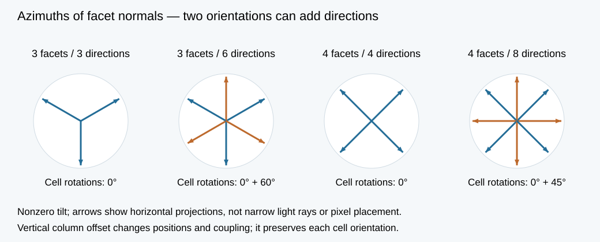

# Available-component baseline and directional variants

29 September 2026. This planning calculation uses catalogue component dimensions, exact normal directions and retained ideal-model coupling data. Its outputs are channel counts, a mounting-size estimate and a radiometric calibration anchor. Measured receive patterns, assembled-electronics noise and reconstruction accuracy are inputs to the subsequent bench experiment.

## Available hardware and its role

| Candidate | Evidence checked | Role in the first experiment |
|---|---|---|
| Discrete red LED, Adafruit #299 | Vendor page displayed **In stock** when opened on 28 September UTC / 29 September Jerusalem; 25-pack with individually accessible leads. [Vendor](https://www.adafruit.com/product/299) | Candidate for emission/reception switching. First measure photocurrent, angular/spectral response, repeatability and recovery for the actual purchased batch. Vendor emission brightness does not specify receive sensitivity. |
| micro:bit V2 LED matrix | Official support identifies the top row as the sensing LEDs; the documented interface returns one light-level value, 0–255. [Official description](https://support.microbit.org/support/solutions/articles/19000024023-how-does-the-light-sensing-feature-on-the-micro-bit-work-) | Demonstration of LED reception and a reference for switching/readout. Independent scene-channel acquisition needs a separate electronics/firmware assessment. |
| Vishay BPW34 photodiode | The live DigiKey page displayed 2,481 in stock; supplier counts are a dated availability observation, with delivery location untested. [Distributor](https://www.digikey.com/en/products/detail/vishay-semiconductor-opto-division/BPW34/1681149) | Separate receiving-element control for a macroscopic faceted fixture with separate illumination. This control tests acquisition geometry; the emitting LED branch has its own calibration. |

The selected near-term path is a small custom fixture with raw access to every element. The discrete-LED branch preserves the proposed same-junction role switching. A separate photodiode fixture supplies a documented receiver reference. The existing [hardware review](../../docs/HARDWARE_PATHS.md) records integrated laboratory panels; a retail complete display with the required independent same-LED raw interface has not been identified in this bounded check.

## Catalogue inputs and a small calculation

The [Vishay datasheet](https://www.vishay.com/docs/81521/bpw34.pdf) gives a 5.4 × 4.3 × 3.2 mm body, 7.5 mm² sensitive area and ±65° half sensitivity. At 950 nm, 5 V reverse bias, 25°C and 1 mW/cm² illumination, typical reverse photocurrent is 50 µA. That irradiance delivers 75 µW to the quoted area, giving a derived typical responsivity of about **0.667 A/W** at that test point. The angular half-sensitivity value describes a broad response; a calibrated angular curve is needed for inversion.

For an illustrative 30° carrier, a regular triangular pyramid side needs a base of at least **18.3 mm** to fit the rectangular body in the specified orientation; the square-pyramid side needs **12.85 mm**. A rectangular envelope expanded by 1 mm on each side raises these bounds to **26.3 / 18.31 mm**. These are side-face body/envelope fits. Lead routing, PCB thickness, three-dimensional clearances and the emitter placement belong to the mechanical design. This exercise sets the scale of a buildable bench fixture; it does not select the tilt of a future display pixel.

## Three, six, four and eight directions

| Arrangement at nonzero tilt | Normal azimuths across the array | Example budget |
|---|---|---|
| Identically oriented three-facet cells | 3 | 8 cells × 3 receivers |
| Three-facet cells in 0°/60° orientations | 6 | 8 cells × 3 receivers, equal orientation groups |
| Identically oriented four-facet cells | 4 | 6 cells × 4 receivers |
| Four-facet cells in 0°/45° orientations | 8 | 6 cells × 4 receivers, equal orientation groups |

Every example has 24 separately read detectors and 180 mm² total sensitive area. Carrier footprints and channel positions still differ and must be included in a reconstruction comparison. These counts describe distinct normal directions across the array, not the number of independent scene parameters. At zero tilt the normal directions coincide. A vertical translation of columns preserves normal directions while changing spacing, visibility and direct coupling. Exact packing of mixed orientations is a separate mechanical constraint.

## What the existing coupling result answers

The script reads the earlier [facet-exchange model](../layout-noise-2026-09-27/README.md), without rerunning its fits. For whole Lambertian facets at 45°, a finite 4×4 triangular array and checkerboard whole-pixel TX/RX scheduling, directly coupled energy fractions were **4.819% aligned, 4.103% with pure stagger, and 3.868% with the author's pitch and stagger**. The corresponding reductions are about **15% and 20%**. Other schedules gave different reductions. This is evidence about the specified external optical path; measured component bodies and cover-layer transport require their own operator.

For the fixture, measure the full source-to-receiver matrix: activate one source at a time, record every receiving region, then repeat with source groups used by the acquisition schedule. Report the largest receiving-channel leakage, the distribution across channels, saturation margins, and target-return signal relative to noise. Compare aligned and shifted carriers at fixed components, source energy and readout time. Use the measured angular response and matrix in reconstruction; mean leakage subtraction retains photon variance.

Run `python calculate.py`. [Results](results.json) include the earlier data hash, unit-normal checks, balanced channel budgets, rectangular-fit equalities and the zero-tilt check. The next bench acquisition supplies measured channel responses and source-to-receiver coupling for the chosen fixture.
