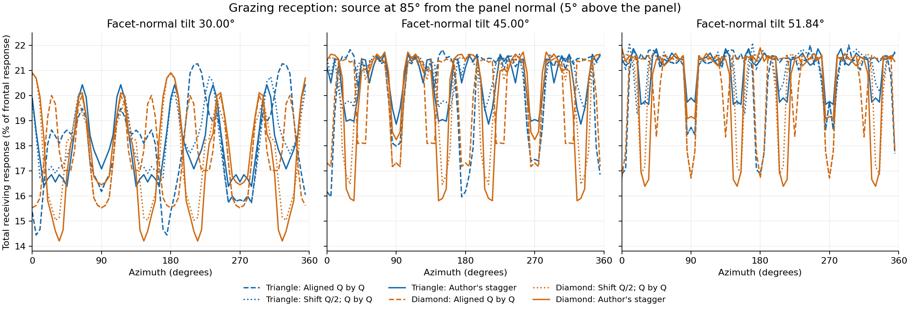

# Треугольники и ромбы: отдельная проверка геометрического затенения

> **Уточнение от 28 сентября:** квадратные пирамиды в этом расчёте имеют одинаковую ориентацию. Предложенный автором вариант с чередующимся поворотом квадратных оснований не рассчитан. Сравнение с ним этими результатами не установлено.

27 сентября 2026. Локальный численный эксперимент; физический прибор не изготовлен.

**Единого победителя по всем проверенным углам нет.** Авторская треугольная укладка лучше квадратных пирамид-ромбов по худшему суммарному отклику при 85° в этих вариантах размеров. При наклоне граней 30° и направлении 75° ромбы имеют больший худший отклик. Это сравнение приёма внешнего света, а не доказательство меньшей паразитной засветки или лучшего восстановления глубины.

## Сопоставимые размеры и контроль сдвига

У всех вариантов площадь основания 35.074029 мм², площадь ячейки 86.602540 мм² и заполнение 40,5%. Треугольник равносторонний со стороной 9 мм; квадрат со стороной 5.922333 мм повернут вершинами по ±x, ±y. Все треугольники направлены вершиной вверх, без чередования ориентации. При одинаковом наклоне нормалей формы имеют одинаковые суммарную площадь боковых граней и фронтальную проекцию. Высота различается; принимающих каналов три или четыре.

1. **Без сдвига Q×Q:** базис `(Q,0),(0,Q)`, Q=9.306049 мм.
2. **Сдвиг Q/2 при Q×Q:** `(Q,Q/2),(0,Q)`. Сравнение с первым вариантом изменяет только сдвиг, сохраняя оба шага и площадь.
3. **Авторская укладка:** `(8.660254,5),(0,10)` мм. Плотность та же; относительно первого варианта меняются и сдвиг, и отношение горизонтального/вертикального шагов.

Первоначальный контроль без сдвига при шагах 8,660254×10 мм **отклонён**: основания треугольников шириной 9 мм пересекаются. Такой вариант нельзя использовать для физического ранжирования. Он сохранён в `rejected_controls` исходных данных.

Минимальный зазор между основаниями, мм:

| Форма | Без сдвига Q×Q | Сдвиг Q/2 при Q×Q | Авторская укладка |
|---|---:|---:|---:|
| Треугольная | 0.306 | 1.512 | 2.206 |
| Квадратная ромбом | 0.931 | 0.931 | 1.625 |

## Угловое сравнение

Угол источника θ отсчитывается от нормали панели; 85° — 5° над плоскостью. Отклик — сумма эффективных принимающих площадей всех граней одного целого пикселя, нормированная на фронтальный отклик. «Худший» — минимальный найденный по азимуту, а не математически доказанный непрерывный минимум.

| Наклон нормали | Форма | Укладка | Худший, θ75° | Худший, θ80° | Худший, θ85° | Средний, θ85° |
|---:|---|---|---:|---:|---:|---:|
| 30.00° | Треугольная | Без сдвига Q×Q | 27.22% | 22.67% | 14.37% | 17.98% |
| 30.00° | Треугольная | Сдвиг Q/2 при Q×Q | 27.22% | 23.85% | 15.73% | 18.05% |
| 30.00° | Треугольная | Авторский сдвиг 5 мм | 27.22% | 24.21% | 16.38% | 18.06% |
| 30.00° | Квадратная ромбом | Без сдвига Q×Q | 31.78% | 25.72% | 15.52% | 17.64% |
| 30.00° | Квадратная ромбом | Сдвиг Q/2 при Q×Q | 31.78% | 25.31% | 15.03% | 17.58% |
| 30.00° | Квадратная ромбом | Авторский сдвиг 5 мм | 31.78% | 25.05% | 14.21% | 17.58% |
| 45.00° | Треугольная | Без сдвига Q×Q | 35.61% | 26.98% | 15.59% | 20.35% |
| 45.00° | Треугольная | Сдвиг Q/2 при Q×Q | 37.86% | 29.74% | 17.32% | 20.56% |
| 45.00° | Треугольная | Авторский сдвиг 5 мм | 38.88% | 31.72% | 19.13% | 20.59% |
| 45.00° | Квадратная ромбом | Без сдвига Q×Q | 39.91% | 29.88% | 17.04% | 19.99% |
| 45.00° | Квадратная ромбом | Сдвиг Q/2 при Q×Q | 38.72% | 28.79% | 16.56% | 20.03% |
| 45.00° | Квадратная ромбом | Авторский сдвиг 5 мм | 38.26% | 27.31% | 15.45% | 20.07% |
| 51.84° | Треугольная | Без сдвига Q×Q | 38.58% | 28.80% | 16.20% | 20.83% |
| 51.84° | Треугольная | Сдвиг Q/2 при Q×Q | 41.82% | 32.25% | 18.45% | 21.00% |
| 51.84° | Треугольная | Авторский сдвиг 5 мм | 43.28% | 33.69% | 19.67% | 21.06% |
| 51.84° | Квадратная ромбом | Без сдвига Q×Q | 42.74% | 31.25% | 17.30% | 20.54% |
| 51.84° | Квадратная ромбом | Сдвиг Q/2 при Q×Q | 40.89% | 30.36% | 17.30% | 20.57% |
| 51.84° | Квадратная ромбом | Авторский сдвиг 5 мм | 39.68% | 28.81% | 15.95% | 20.46% |

Десятые и сотые здесь позволяют сопоставлять расчёты; они не задают точность будущего устройства. Малые различия нельзя надёжно ранжировать без дальнейшего уточнения.

## Метод и проверки

Бесконечная периодическая решётка непрозрачных выпуклых пирамид. Источник далёкий и коллимированный. Каждая боковая грань имеет косинусный отклик; лучи от равновеликих участков её реальной площади проверяются на пересечение с соседними телами. Неосвещённые грани имеют нулевой отклик; отдельного самозатенения положительно ориентированной грани выпуклой пирамиды нет.

Проверены θ=0°,30°,45°,60°,75°,80°,85°; азимут через 5°. Основной расчёт: **32²=1024 точки на грань**. Окрестности двух разнесённых кандидатов на минимум и максимум уточнены при 64²=4096 точках с локальным шагом азимута 2,5°. Максимальное изменение ответа 32²→64² на этих одинаковых выбранных направлениях — **0.624 процентного пункта** фронтального отклика. Это оценка сходимости выборок, не строгая граница ошибки.

- Проверены нормали, равнобедренность боковых граней, равные площади и плотности, непересечение оснований.
- Независимый алгоритм Möller–Trumbore дал те же решения о видимости на 996 выбранных лучах от освещённых граней.
- Расширение радиуса соседей на 10 мм не изменило выбранные контрольные ответы.
- Аналитическая фронтальная проекция совпала; проверена граница потока на площадь ячейки. Наибольшее превышение расчёта над этой границей: 0.203594 мм²; отрицательное число означает запас до границы.

**Границы:** не моделируются преломление, покрытия, дифракция, отражения между гранями, поддерживающие структуры, электрические помехи, шум, дальность и реконструкция сцены. Широкий суммарный отклик не равен независимости каналов. Большой зазор между основаниями сам по себе не устанавливает малую прямую оптическую связь между соседями. Влияние числа каналов на шум электроники здесь не сопоставлено. Полный FOV или глобальный оптимум не устанавливаются.

## Файлы

- [geometry_benchmark.py](geometry_benchmark.py) — модель и независимые геометрические проверки.
- [geometry-results.json](geometry-results.json) — все 18 допустимых конфигураций и отклонённый контроль.
- [geometry_report.py](geometry_report.py) — таблица и графики.

Воспроизведение: `python geometry_benchmark.py`, затем `python geometry_report.py`.
