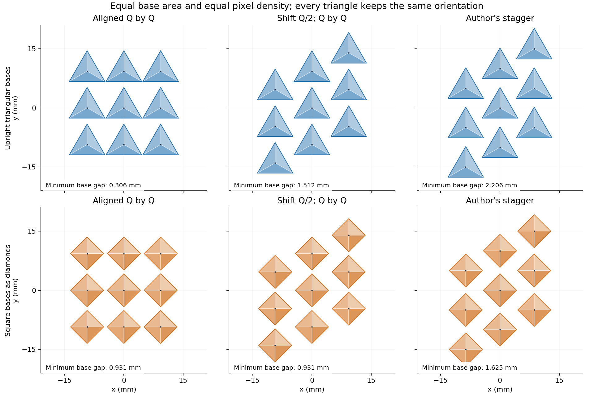
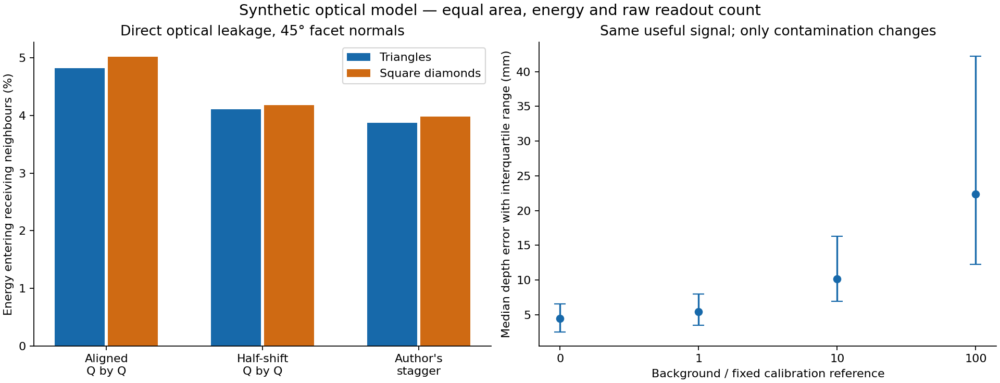
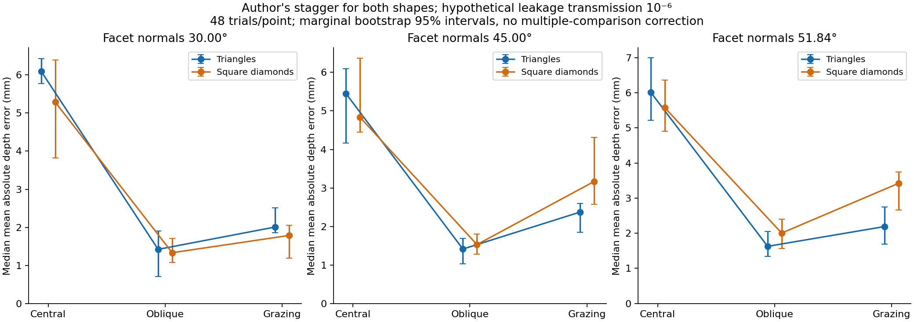

# FacetSensus: сдвиг, помехи соседей и точность глубины

> **Уточнение от 28 сентября:** квадратные пирамиды в этом расчёте имеют одинаковую ориентацию. Предложенный автором вариант с чередующимся поворотом квадратных оснований не рассчитан. Сравнение с ним этими результатами не установлено.

27 сентября 2026. **Локальная вычислительная проверка, не измерения изготовленного дисплея.**

Проверены 18 сочетаний формы, угла и укладки; выполнены **7 776 шумных восстановлений** в основном опыте и **1 024** в контроле влияния засветки. Всего **8 800** шумных подгонок. Не все реализации сходятся: один основной запуск не достиг критерия остановки в заданный бюджет; он отмечен ниже, результат не скрыт.

## Ответ на гипотезу

При сохранении полезного сигнала и его зависимости от сцены уменьшение посторонней засветки помогает восстановлению. Отдельный контроль с неизменной геометрией это подтверждает.

Для заданного чередования целых излучающих и принимающих пикселей авторская треугольная укладка уменьшила прямую оптическую связь соседей примерно на **20%** относительно допустимой ровной сетки той же плотности. Только полушаговый сдвиг при неизменных двух шагах уменьшил связь примерно на **15%**. Это подтверждает полезность укладки в рассматриваемой модели.

Однако квадратные пирамиды, поставленные ромбами, также получают пользу от сдвига. В авторской укладке их суммарная прямая засветка всего примерно на 3% больше треугольной при 45°. Полезные угловые сигналы и восстановление глубины различаются по сценам. **Универсальное превосходство трёхгранных пирамид над ромбами не установлено.** Угол 51,84° также не стал универсальным оптимумом.

## Что именно сопоставлялось

1. Треугольное основание со стороной 9 мм, все вершины направлены вверх в плане. Три независимые грани.
2. Квадратное основание равной площади, сторона 5,922333 мм, вершины по ±x/±y. Четыре независимые грани.

Площадь основания 35,074029 мм², площадь ячейки 86,602540 мм². Наклоны нормалей: 30°, 45°, 51,842773°. При одном наклоне одинаковы суммарная площадь граней и фронтальная проекция. Между разными наклонами площадь граней меняется: `A_base/cos(α)`. Высота при разных формах также различается; сравнение формы не сводится к одному числу граней.

Три укладки:

- **Ровная Q×Q:** шаг Q=9,306049 мм в обоих направлениях.
- **Только сдвиг:** те же шаги, нечётные столбцы подняты на Q/2. Это чистый контроль сдвига.
- **Авторская:** расстояние столбцов 8,660254 мм, вертикальный шаг 10 мм, вертикальный сдвиг нечётных столбцов 5 мм. Плотность сохраняется; по сравнению с ровной сеткой меняются сдвиг и соотношение шагов.

Простое удаление сдвига из авторской укладки при сохранении шагов 8,660254×10 мм приводит к пересечению треугольных оснований. Такой контроль исключён. Непересечение всех используемых оснований проверено.



## Три разных эффекта

**Затенение:** соседи перекрывают часть полезного внешнего света. Рассчитано отдельно для периодической матрицы, с интегрированием по граням и направлениям. При скользящих направлениях у треугольников бывают преимущества; при других углах лучше ромбы. Подробные таблицы: [геометрия](GEOMETRY_RU.md).

**Прямая засветка:** свет излучающего пикселя попадает в принимающий пиксель без отражения от объекта. Рассчитаны пары конечных площадок на гранях с их направлениями, расстояниями и перекрытием другими пирамидами. Модель предполагает непрозрачные пирамиды и идеальные ламбертовские грани. Внутренние отражения, покровный слой, волноводы, электрическая наводка и переотражения не учитываются.

**Восстановление:** совместное определение двух глубин и шести цветовых коэффициентов по сигналам всех принимающих граней при движении панели. Снижение засветки может помочь, но между геометриями меняется и полезная информация о сцене.

## Ресурсы и режим работы

Для обратной задачи панель содержит 4×4 целых пикселя. Они помещаются в общую выделенную область 40×48 мм; точные крайние положения элементов различаются между укладками. Края массива не периодические. Три известные позиции панели: x=−20,0,+20 мм. В каждой позиции два такта: восемь пикселей излучают всеми гранями, остальные принимают; затем роли меняются. Клеточный рисунок задаётся чётностью строки+столбца.

Полная энергия и время экспозиции одинаковы, энергия делится между тремя идеальными спектральными полосами. Число исходных считываний тоже одинаково: на принимающий пиксель и такт приходится 12 чтений — три грани по четыре подэкспозиции либо четыре грани по три. После сложения шум считывания каждой грани имеет дисперсию `(12/k)·4` электрон², суммарно 48 электрон² на пиксель. На весь опыт приходится 1 728 исходных значений. Предполагаются независимый шум, одинаковая стоимость считывания и отсутствие дополнительного времени переключения. Число физических каналов электроники остаётся разным.

## Прямая оптическая связь соседей

Таблица показывает долю всей излучённой энергии, которая прямо приходит в принимающие соседние пиксели за расписание из двух ролей, до любого дополнительного подавления. Это **условная геометрическая оценка**, не измеренная засветка будущего экрана.

| Форма | Наклон | Ровная Q×Q | Только сдвиг Q/2 | Авторская укладка |
|---|---:|---:|---:|---:|
| Треугольники | 30.00° | 2.009% | 1.709% | 1.608% |
| Треугольники | 45.00° | 4.819% | 4.103% | 3.868% |
| Треугольники | 51.84° | 6.697% | 5.707% | 5.388% |
| Ромбы | 30.00° | 2.099% | 1.744% | 1.659% |
| Ромбы | 45.00° | 5.017% | 4.175% | 3.977% |
| Ромбы | 51.84° | 6.953% | 5.793% | 5.525% |

Схема включения тоже важна. Для треугольников при 45° переход от ровной к авторской укладке снижает засветку примерно на 20% при клеточном расписании, примерно на 2% при чередовании целых столбцов и примерно на 7% при чередовании строк. Альтернативные расписания проверены по засветке; их инверсия не выполнялась. Выигрыш нельзя целиком приписать одной форме основания независимо от режима работы.



## Контроль: меняем только засветку

Фиксированы треугольная авторская укладка, наклон 45°, центральная сцена, полезный сигнал и обратная модель. Дополнительный фон равномерно распределён по каналам и не зависит от подбираемой сцены. Эталон — заранее заданные 100 000 электронов от отдельного белого участка на оси при 150 мм; полезный сигнал контрольной сцены — примерно 101 231 электрон.

Для каждого уровня выполнено 256 независимых реализаций. В каждом опыте берётся средняя абсолютная ошибка двух глубин; в таблице — её медиана и 90-й процентиль.

| Засветка / фиксированный эталон | Медианная ошибка глубины | 90-й процентиль |
|---:|---:|---:|
| 0 | 4.50 мм | 8.26 мм |
| 1 | 5.44 мм | 11.66 мм |
| 10 | 10.14 мм | 26.42 мм |
| 100 | 22.37 мм | 64.32 мм |

Именно этот опыт проверяет причинную часть «меньше засветки → лучше оценка при прочих равных». В основном сравнении прочие условия геометрически различаются, поэтому там такой вывод нельзя предполагать заранее.

Физическая модель шума:

```text
raw = Poisson(S + L) + Normal(0, sigma_read²)
corrected = raw - L
Var(corrected) = S + L + sigma_read²
```

Даже точное вычитание средней засветки L оставляет её фотонный шум. При неизменном S уменьшение L на 20% не означает уменьшение ошибки глубины на 20%. Например, если L=S, стандартное отклонение суммарного фотонного шума уменьшается лишь примерно на 5%; при полностью доминирующем L — примерно на 11%. Это иллюстрация дисперсии измерения, не гарантия ошибки нелинейной реконструкции.

## Основной опыт восстановления

Известны координаты x,y двух участков, площадь 1 мм², нормали (0,0,−1), позы панели, мощность и калибровка каналов. Ищутся две глубины и шесть коэффициентов отражения в диапазоне 0…1. Центральная сцена имеет глубины 111,3/156,7 мм, боковая 80,7/117,3 мм, скользящая 30,3/50,7 мм; координаты полностью сохранены в JSON. Это три маленькие синтетические сцены, не карта произвольного окружения. Цветовые полосы условно независимы и калиброваны; три грани не отождествляются с RGB.

Грани интегрируются по 16 площадкам, каждый целый пиксель состоит из реальных наклонных граней с различными центрами. Полезный сигнал включает угловые множители при излучении и приёме и перекрытие другими пирамидами. Истинные глубины находятся между узлами сетки 1 мм. Поиск начинается с сетки 2 мм и непрерывно уточняется по интерполированной модели. Точная модель генерирует показания; интерполяция в инверсии даёт небольшое численное несовпадение.

Одна общая константа переводит энергию в условные электроны, её не подбирают заново под форму или сцену. Добавлены пуассоновский шум и шум считывания. Прямая связь соседей умножается на три **гипотетических** коэффициента передачи: 0, 10⁻⁶, 10⁻⁴. Это сценарии остаточной засветки; физическая реализация подавления на такую величину и сохранение полезного сигнала не доказаны. Даже малый остаток может быть большим относительно слабого отражения от маленького объекта. Не моделируются насыщение, ограничение динамического диапазона и фоновое освещение.

В основной инверсии средняя паразитная засветка считается точно известной и вычитается. Отрицательные остатки сохраняются. Используется взвешенный метод наименьших квадратов с дисперсией, оценённой по исходным показаниям; это не точное пуассоновско-гауссово правдоподобие. Отдельный диагностический опыт в JSON вводит фиксированную ошибку вычитания 0,1% при передаче 10⁻⁴.

Пример при наклоне 45°, авторской укладке обеих форм и передаче паразитного света 10⁻⁶:

| Сцена, 45° | Треугольники | Ромбы | 95% интервал разности медиан, мм |
|---|---:|---:|---:|
| Центральная | 5.45 мм | 4.84 мм | [-1.19; +1.48] |
| Боковая | 1.41 мм | 1.53 мм | [-0.64; +0.29] |
| Скользящая | 2.37 мм | 3.16 мм | [-2.00; -0.11] |

Интервалы получены по 2 000 bootstrap-выборок из 48 реализаций. Это исследовательская оценка случайного разброса; поправки на множественные сравнения нет. Небольшое различие медиан не следует называть установленным преимуществом. Все углы, укладки и уровни засветки доступны в [CSV](depth-summary.csv), а полные реализации — в [JSON](depth-results.json).



## Проверки и ограничения

- Проверены геометрия и равенство площадей, отсутствие пересечений оснований, сохранение энергии и взаимность прямой оптической связи.
- Для четырёх конфигураций при 45° уточнение двойного интегрирования засветки с 16 до 64 точек на грань изменило суммарную связь не более чем на 0.715%. Это меньше найденного эффекта сдвига около 20%, но малые межформенные различия всё равно трактуются осторожно.
- В тех же контролях уточнение полезных сигналов центральной/скользящей сцен изменило их относительную норму не более чем на 0.805%. Худший случай дополнительно проверен по 256 точкам на грань; следующее изменение около 0.263%.
- Максимальная относительная погрешность интерполяции в основных сценах — 0.542%; максимальная ошибка глубины в нешумном контрольном восстановлении — 0,266 мм. Это численная погрешность выбранного расчёта.
- Из 7 776 основных шумных подгонок одна не достигла критерия сходимости при лимите 180 оценок вектора невязок (max_nfev): `diamond-shifted-51.842773`, скользящая сцена, передача 10⁻⁶, реализация 17 с нуля. Её последнее приближение остаётся в исходной сводке и помечено `success=false`; для неё нельзя заявлять завершённую оптимизацию. Она не входит в таблицу выше, сравнивающую авторскую укладку при 45°.
- В геометрическом угловом опыте проверены 996 лучей независимым методом Möller–Trumbore; решения совпали. Уточнение 1 024→4 096 точек на грань изменило выбранные отклики не более чем на 0,625 процентного пункта фронтального отклика. Это выборочная сходимость, не строгая граница ошибки для всех направлений.
- Один и тот же класс модели используется для генерации и объяснения данных. Не моделируются неизвестные нормали/площади поверхностей, текстурированная сцена, ошибки позы, динамика, реальная спектральная чувствительность, покрытие и электрические наводки. Нейросеть и долговременная карта не реализованы.

## Итог для концепции

Расчёт поддерживает снижение прямой паразитной связи за счёт вертикального сдвига при выбранном режиме работы. Он подтверждает и вред дополнительного фотонного шума для обратной задачи. Следующее обоснованное утверждение — полезность **совместного выбора укладки, углов, расписания и калибровки**. Более сильное утверждение «эта треугольная матрица всегда лучше любых ромбов восстанавливает окружение» результатами не подтверждается.

## Воспроизведение

```text
python geometry_benchmark.py
python geometry_report.py
python depth_benchmark.py --trials 48 --facet-n 4
python controlled_noise.py
python validate_depth.py
python analyze.py
```

Нужны NumPy, SciPy и Matplotlib. Основной опыт с 7 776 шумными подгонками занял 214.8 с; контроль 1 024 подгонок — 10.7 с. Это время исследовательского кода на текущем компьютере, не частота кадров будущего прибора. В архив включена используемая зависимость `../facet-motion-2026-09-26/model.py`; папки надо сохранять рядом.

[Протокол и независимые замечания](PROTOCOL_REVIEW.md) · [Проверка численной точности](validation-depth.json) · [Сравнения с интервалами](comparisons.json) · [Флаги сходимости](solver-flags.json)
