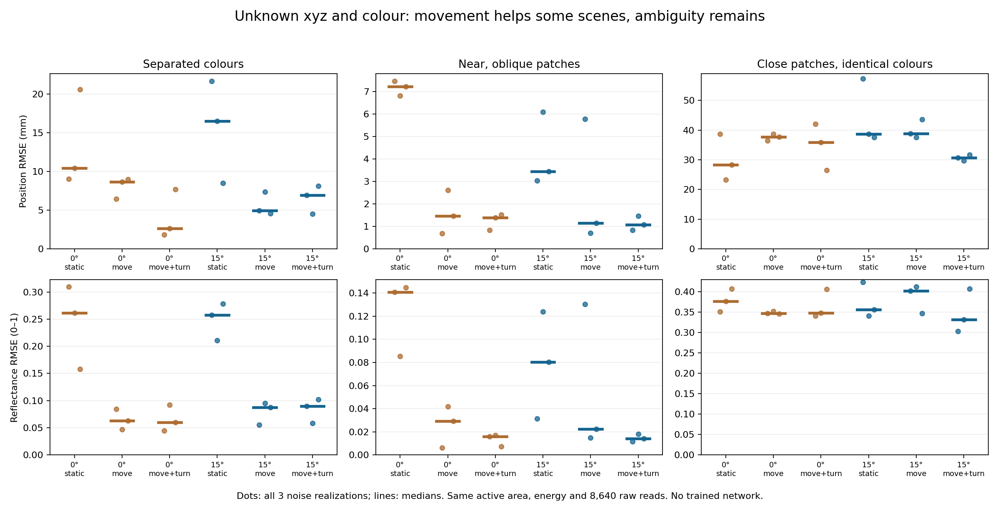
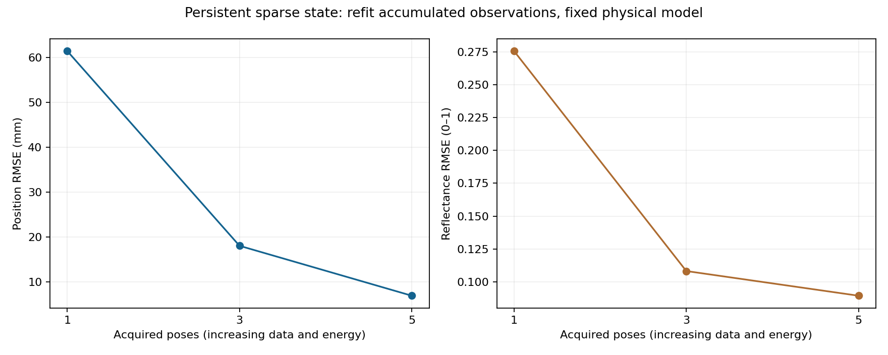

# Joint xyz and three-band appearance reconstruction

**Implemented synthetic demonstrator; no fabricated device or trained network.** Three small diffuse patches have unknown positions and reflectances (18 fitted parameters). Patch count, 1 mm² areas and world normals are known. This extends the earlier known-lateral-position experiments, but does not reconstruct arbitrary surfaces or texture.

## Matched acquisition

A 4×4 panel compares coplanar regions and 15° facets at equal total active area. Five static/repositioned poses and six complementary checker/row/column source patterns give 2,160 aggregate measurements from 8,640 raw reads across three ideal spectral bands. Static acquisition repeats one pose. Translation uses centre and ±20 mm x/y positions; combined motion adds up to 10° rotations to the same centre positions. Panel positions and normals rotate in world space; scene normals remain fixed.

Total source energy and integration allocation are matched; mechanical motion/settling costs are excluded. One common electron calibration is used without equalizing collected photons. Primary direct-leakage transmission η=10⁻⁶ is hypothetical. Noise is sampled before mean leakage correction. There is no real sensor spectral response, saturation, internal coupling or fabricated isolation mechanism.

Truth uses 16 quadrature points/facet and inversion uses four. The forward operator omits panel shadows; separate sampled checks found none at any true or final estimated patch positions in these 60 cases. This does not check all optimizer intermediate states. Scene occlusion and extended-patch effects are excluded.

## Results

Median xyz RMSE in mm across three independent noise realizations per case:

| Scene | Flat static | Flat translation | Flat combined | 15° static | 15° translation | 15° combined |
|---|---:|---:|---:|---:|---:|---:|
| separated_colours | 10.41 | 8.63 | 2.61 | 16.48 | 4.96 | 6.93 |
| near_oblique | 7.23 | 1.47 | 1.39 | 3.45 | 1.14 | 1.07 |
| similar_colours_close | 28.31 | 37.66 | 35.86 | 38.66 | 38.87 | 30.61 |



For the near/oblique scene, 15° combined motion reduces the observed median position RMSE from 3.45 to 1.07 mm and reflectance RMSE from 0.080 to 0.014. Flat combined acquisition also recovers that scene (1.39 mm). The first scene favors the flat combined control (2.61 vs 6.93 mm). The identical-colour scene fails across all configurations, with median position errors around 28–39 mm despite sometimes predicting held-out signals within 1%. There is no established universal facet or rotation advantage.


## Solver, retained failures and evolving state

All configurations use six generic starts, the same search bounds and 220-evaluation limit per start. Ground truth is used for data generation and scoring, not initialization or choosing the best start. The solver jointly estimates xyz and reflectance by observed-count-weighted least squares; it is not an exact Poisson likelihood. Four held-out poses check predicted signals without choosing the fitted solution. Matching unordered patches by position precedes appearance scoring.

The 60 data sets require 360 optimizer runs: 20 do not converge within budget; three selected best fits do not converge, and 30 best fits touch a coordinate or reflectance boundary. All are retained. Similar-cost starts can be tens of millimetres apart. The 1%-or-one-objective-unit diagnostic is heuristic, not a calibrated confidence set or proof of uniqueness. Only three scenes and three noise repetitions were studied; medians describe this experiment, not population-level superiority.

A separate accumulated-state example refits after 1/3/5 poses, retaining all measurements and using the previous state as one start. Position RMSE changes 61.43→18.05→6.93 mm. Energy/data increase with the sequence, so this is not a matched-budget fusion advantage. The stored state has no new-surface discovery, dynamic association, trained weights or calibrated posterior.



Pose perturbations of 0.5 mm/0.5° increase one condition's median RMSE from 6.93 to 12.27 mm across three realizations. A higher-leakage stress has median 5.42 mm but mean 7.40 vs 6.51 mm: the small independent noise sample is insufficient to infer a monotonic median trend. After the failures were observed, four matched-model noiseless diagnostics recovered the known scenes to numerical precision from generic starts. Those tests check implementation consistency, not independent physical identifiability or robustness.

## Reproduction and scope

Read the complete [Russian report](REPORT_RU.md), [pre-fit protocol](experiment-protocol.json), [protocol review](PROTOCOL_REVIEW.md), [source model](scene_model.py), [full results with raw first-trial measurements](experiment-results.json), [all case metrics](metrics.csv), [failure/boundary flags](solver-flags.json), [summary](summary.json), [sequential states](sequential-results.json), [post-result diagnostic protocol](diagnostic-protocol.json), [diagnostic results](diagnostic-results.json) and [model checks](model-checks.json). The separate pilot is retained in [pilot-results.json](pilot-results.json); it is excluded from main statistics.

Use the [existing pinned dependencies](../layout-noise-2026-09-27/requirements.txt) and retain adjacent model directories. In this directory:

```text
python check_model.py
python run_experiment.py
python sequential_example.py
python diagnose_inverse.py
python analyze_scene.py
python write_report.py
```

Checks cover analytic spatial derivatives, rigid-transform invariance, selected quadrature refinement, pose-invariant direct leakage, geometric reciprocity/energy and far-point scaling. Optical/electronic hardware, general-surface mapping, useful distant range, learned reconstruction and novelty remain unvalidated. The implemented state update is a restricted example within the broader proposed architecture.
