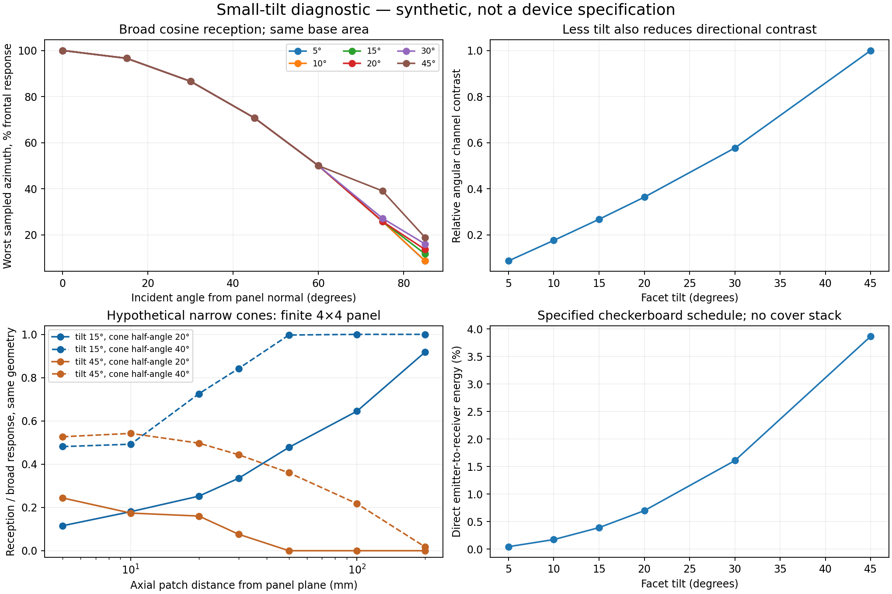

# Малый наклон граней и фронтальная чувствительность

28 сентября 2026. Расчёт идеализированной геометрии; не измерение устройства и не восстановление глубины.

## Вывод

15° добавлен как кандидат для дальнейшей проверки. **Прямо перед экраном при 45° в прежней широкой косинусной модели нет полной слепой зоны.** При 15° её также нет. Нормаль грани задаёт максимум чувствительности, а не единственный видимый луч. Узкая оптика может менять этот вывод, но её реальная характеристика пока не задана.

Угол здесь — наклон нормали грани от нормали экрана, численно равный наклону боковой грани к плоскости экрана. Основание — равносторонний треугольник со стороной 9 мм; ориентация и вертикальный сдвиг столбцов сохранены.

## Рассчитанные малые углы

| Наклон | Высота, мм | Фронтальный отклик на равную площадь грани | Угловой контраст относительно 45° | Прямая засветка соседей |
|---|---:|---:|---:|---:|
| 5° | 0.227 | 99.6% | 0.087 | 0.043% |
| 10° | 0.458 | 98.5% | 0.176 | 0.172% |
| 15° | 0.696 | 96.6% | 0.268 | 0.389% |
| 20° | 0.946 | 94.0% | 0.364 | 0.697% |
| 30° | 1.500 | 86.6% | 0.577 | 1.608% |
| 45° | 2.598 | 70.7% | 1.000 | 3.868% |

Столбец фронтального отклика равен cos(наклон). При **равной площади основания**, как в нашем сравнении пирамид, их разная полная площадь компенсирует этот множитель: суммарный фронтальный приём равен 100% для всех шести вариантов. При равной площади самих граней увеличение 45°→15° составляет около 36,6%. Эти нормировки нельзя смешивать. Это пассивный приём; изменение диаграммы активного излучения — отдельный фактор.

Засветка относится только к прямой связи конечных граней 4×4 панели с выбранным клеточным чередованием целых излучающих/принимающих пикселей. При 15° она равна 0.389% против 3.868% при 45°. Электрические утечки, покрытие, переотражения и их шум не посчитаны. Уточнение 16→64 точек на грань меняет эти два значения относительно уточнённых на 0.92% и 0.71%. Это не доказательство выигрыша глубины.



## Почему уменьшение наклона не является бесплатным улучшением

Пока все три грани видят направление без отсечения и тени, нормированный среднеквадратический разброс каналов равен

```text
CV = tan(alpha) * tan(theta) / sqrt(2)
```

Здесь theta — направление света от нормали экрана. При одинаковом theta переход 45°→15° оставляет примерно 0,268 углового контраста. Это не означает ухудшение глубины ровно в 3,73 раза: глубина также зависит от положения пикселей, движения, освещения и шума. Но различия граней, помогающие различать направления, ослабевают. При строго фронтальном свете три показания равны; производные по малому боковому изменению направления остаются ненулевыми при ненулевом наклоне.

## Когда мёртвая зона действительно появляется

Дополнительный идеальный конус приёма полуугла beta пропускает фронтальное направление отдельной грани, если beta >= alpha. Например, при beta=20° наклон 45° исключает ось в дальней угловой модели, а наклон 15° включает её. Это **условный сценарий**, не характеристика наших диодов.

Для конечной панели расположение каждого приёмника тоже важно. Дополнительно рассчитан малый диффузный участок по общей оси панели на расстояниях 5, 10, 20, 30, 50, 100 и 200 мм. У всех шести наклонов широкий приём даёт ненулевой суммарный сигнал во всех этих точках. График показывает, как гипотетические конусы 20°/40° изменяют приём для 15° и 45°. Это линия проверочных точек, не карта всей трёхмерной зоны; очень близкие поверхности, конечная площадь объекта и порог обнаружения требуют отдельного расчёта.

Полное отсутствие сигнала, сигнал ниже шумового порога и невозможность различить две глубины — разные виды ограничений. Для физической границы рабочей зоны нужны измеренный угловой отклик, спектральная чувствительность, шум, освещение и критерий ошибки глубины. Сейчас таких данных нет.

## Методика и воспроизведение

Периодическая геометрия проверена при 7 полярных углах и 24 азимутах, 256 точек на грань; приведён минимум по этой сетке, не непрерывный глобальный минимум. Фронтальный результат дополнительно проверен точной проекционной формулой. Конечная панель и конусы интегрированы по 64 точкам на грань; вариант без конуса совпадает с прежним ядром до численной точности. Аналитическая формула контраста проверена по трём отдельным каналам. Источники кода и их хеши сохранены в JSON.

Запуск: `python sweep.py`. Требуются NumPy, SciPy и Matplotlib; используются соседние каталоги `../layout-noise-2026-09-27` и `../facet-motion-2026-09-26`. [Исходные результаты](results.json). Новых шумных подгонок глубины, оптимизации угла, обучения и аппаратных опытов здесь нет.

Публикационная формулировка: «Малые наклоны 10–20°, включая 15°, рассматриваются для уменьшения высоты и прямой связи соседей при сохранении фронтального приёма. Выбор требует учёта углового различения и реальной оптики; 15° не объявляется оптимумом». Общий компромисс светосбора и различимости измерений также обсуждается в [OrbCam](https://arxiv.org/html/2306.15953v1); приведённые здесь числа — наш геометрический расчёт, не результаты этой статьи.
